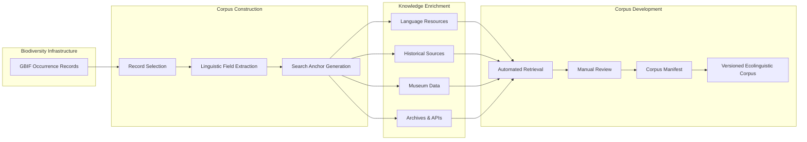

# Biodiversity Corpus Pipeline

An open-source research workflow for constructing biodiversity-linked ecological corpora from biodiversity occurrence records, historical archives, linguistic resources, and other linked knowledge sources.

Rather than treating biodiversity databases as the corpus itself, this project explores how biodiversity infrastructures can serve as reproducible entry points for corpus construction.

---

## Project vision

Biodiversity records contain rich contextual information—including taxonomy, geography, time, collectors, expeditions, institutions, and provenance—that can act as search anchors for discovering related textual resources.

This project develops a reproducible workflow that links biodiversity occurrence data with:

- historical literature
- archival collections
- museum documentation
- library catalogues
- Indigenous language resources
- other biodiversity knowledge infrastructures

The result is a versioned, provenance-aware ecological corpus suitable for corpus linguistics, digital humanities, biodiversity informatics, and environmental history.

---

## Workflow



---

## Current architecture

```
src/
    biodiversity_corpus/
        gbif/
        languages/
        corpus/

scripts/
    download_*.py

data/
    raw/
    interim/
    curated/
    reference/

docs/

tests/
```

External reference datasets are downloaded reproducibly using versioned download scripts rather than committed directly to the repository.

---

## Knowledge enrichment

Current work focuses on a language-enrichment layer that investigates whether biodiversity occurrences can be linked to publicly documented linguistic resources.

Example workflow:

```
GBIF occurrence
        ↓
Coordinates
        ↓
Candidate language areas
        ↓
Stable language identifiers
        ↓
Documented lexical resources
        ↓
Vernacular species names
        ↓
Corpus enrichment
```

Candidate language associations are treated as research hypotheses requiring explicit provenance and manual review rather than automated factual assertions.

---

## Initial pilot

The initial pilot focuses on Canadian biodiversity records and the Bernier Arctic Expedition (1908–1909).

The workflow currently aims to:

1. query GBIF;
2. preserve raw API responses;
3. extract linguistic and historical search anchors;
4. generate candidate language associations from georeferenced occurrences;
5. identify publicly documented vernacular species names;
6. construct a provenance-aware ecological corpus.

---

## Research principles

- Preserve original records.
- Preserve provenance.
- Separate automated discovery from scholarly interpretation.
- Keep source transformations explicit.
- Record uncertainty rather than hiding it.
- Treat language associations as candidate relationships.
- Respect community governance and culturally sensitive knowledge.
- Preserve dialectal, orthographic, and historical variation.
- Do not infer undocumented vernacular names.
- Treat absence and uneven representation as research findings.

---

## Roadmap

### Phase 1

- GBIF API client
- reproducible download framework
- corpus manifest
- search-anchor generation

### Phase 2

- Glottolog connector
- language enrichment
- historical archive connectors
- museum metadata connectors

### Phase 3

- lexical resource connectors
- corpus construction
- WorkflowHub publication

### Phase 4

- reusable research workflow
- methods paper
- comparative case studies

---

## Status

Active research prototype.

Current focus:

- reproducible reference datasets
- language-enrichment architecture
- provenance-aware corpus construction
- first end-to-end GBIF workflow
