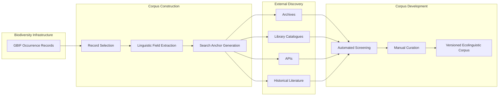

# Biodiversity Corpus Pipeline

An API-assisted workflow for building ecolinguistic corpora from biodiversity occurrence data, historical archives, and linked textual sources.

## Project goal

This project explores biodiversity infrastructures, beginning with GBIF, as reproducible entry points for constructing ecological text corpora.

GBIF is treated as a sampling and retrieval infrastructure rather than as the corpus itself.

## Initial workflow



## Initial pilot

The first pilot will:

1. query Canadian GBIF occurrence records;
2. preserve raw API responses;
3. extract narrative and linguistic fields;
4. generate search anchors from taxa, places, dates, people, datasets, and expeditions;
5. document absence, mediation, provenance, and uncertainty.

The Bernier expedition to the Canadian Arctic, 1908–1909, is an initial candidate case study.

## Setup

Requires Python 3.11 or later.

```powershell
python -m venv .venv
.\.venv\Scripts\Activate.ps1
pip install -e ".[dev]"
```

## First API test

```python
from biodiversity_corpus.gbif import search_occurrences

response = search_occurrences(
    country="CA",
    scientific_name="Rangifer tarandus",
    limit=10,
)

print(response["count"])
```

## Research principles

- Preserve original records and source URLs.
- Keep automated retrieval separate from human validation.
- Record genre, language, translation history, rights, and technical mediation.
- Do not treat external texts as unmediated or complete representations.
- Do not assume culturally governed or community-held knowledge is available for automated collection.
- Treat absence and uneven representation as findings rather than merely technical defects.

## Status

Early exploratory research prototype.
