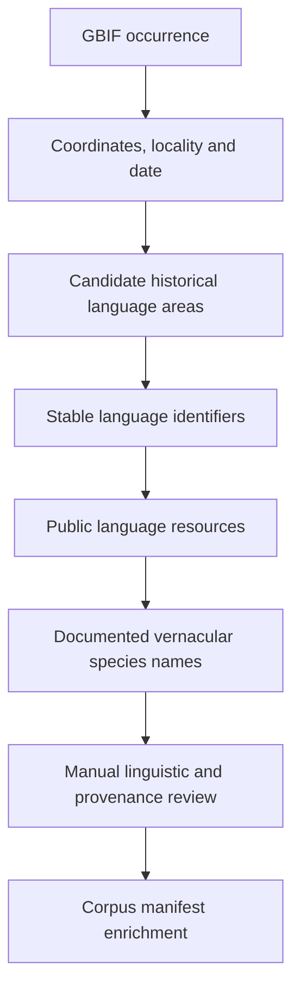

# Indigenous language and vernacular-name enrichment

## Aim

This layer explores whether a biodiversity occurrence can help identify
publicly documented language resources relevant to its place, time, and taxon.

It does not treat a coordinate as proof that one language or community is
uniquely associated with a record. It also does not claim to recover
community-held knowledge automatically.

## Workflow

## Important distinction

The pipeline should preserve these as separate claims:

1. a GBIF record is associated with a place and date;
2. one or more sources associate languages with that place;
3. a lexical source documents a species name;
4. the lexical form may be specific to a dialect, orthography, period, or genre.

These should never be collapsed into a statement such as:

> The Indigenous name for this species is ...

## Suggested fields

### Language association

- GBIF ID
- coordinates
- coordinate uncertainty
- occurrence date
- candidate language
- stable language identifier
- spatial source
- temporal basis
- confidence
- review status

### Vernacular name

- scientific name
- language name and identifier
- documented lexical form
- orthography
- dialect or variety
- source title and URL
- source type
- place and time context
- community attribution
- provenance notes

## Guardrails

- Use publicly available resources unless explicit permission has been obtained.
- Preserve source-specific access and reuse conditions.
- Represent overlap and uncertainty.
- Do not infer undocumented names from related languages.
- Preserve dialectal, orthographic, and historical variation.
- Treat colonial dictionaries and archival texts as mediated historical sources.
- Require manual review before publication.
